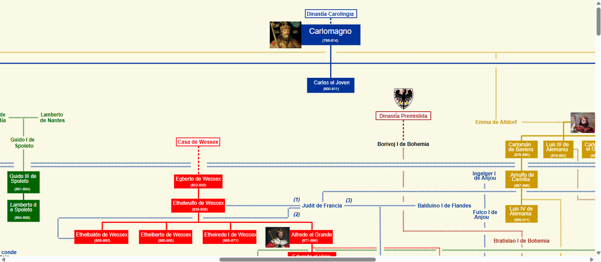
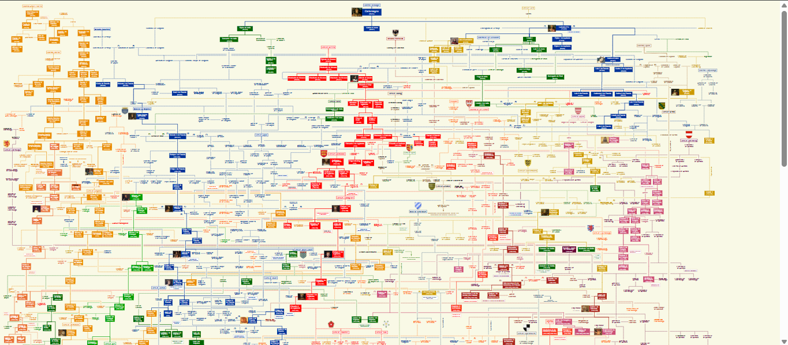

# 👑 Árbol Dinástico Europeo

Un visualizador web interactivo diseñado para explorar las intrincadas dinastías y linajes reales europeos desde la época de Carlomagno hasta la actualidad. 

El proyecto procesa un mapa genealógico masivo vectorizado en formato SVG (exportado originalmente desde LibreOffice) y proporciona una experiencia de navegación fluida similar a un mapa interactivo, con acceso directo a información histórica.

## 📸 Vista Previa del Proyecto

Aquí puedes observar el funcionamiento y la interfaz del visualizador dinástico:

<table>
  <tr>
    <td width="50%" align="center">
      <b>Vista General Inicial (Foco en Primer Plano de Carlomagno)</b><br/>
      <b></b><br/>
      
    </td>
    <td width="50%" align="center">
      <b>Perspectiva Macroscópica (Escala al 25% de Zoom)</b><br/>
      <b></b><br/>      
      
    </td>
  </tr>
</table>


## 🚀 Características Clave

* **Navegación Intuitiva de Gran Escala:** Soporte para desplazamientos multidireccionales nativos y zoom de alta fidelidad dinámico (mediante combinaciones de `Ctrl + Rueda del ratón`) que mantiene la nitidez tipográfica en niveles de escala extremos.
* **Foco Inicial Inteligente:** Al cargar la aplicación, el lienzo calcula automáticamente las dimensiones dinámicas y posiciona el visor de manera precisa en la sección superior central, donde se localiza Carlomagno.
* **Integración con Wikipedia:** El lienzo SVG contiene cientos de hiperenlaces que redirigen automáticamente a los artículos biográficos correspondientes en pestañas independientes.

## 🛠️ Tecnologías Utilizadas

* **Backend:** Python con el micro-framework Flask.
* **Frontend:** HTML5, CSS3 clásico y JavaScript nativo (Vanilla JS).
* **Gráficos:** SVG interactivo con inyección dinámica de DOM y aislamiento de eventos.

## 📁 Estructura del Proyecto

La organización interna dentro del directorio local se compone de la siguiente manera:

```text
ArbolGenealogico/
│
├── app.py                  # Servidor Flask principal y ruteo
├── templates/
│   └── index.html          # Estructura del visor web
└── static/
    ├── styles.css          # Estilos CSS de la interfaz y lienzos
    ├── script.js           # Lógica de manipulación del SVG, zoom y enlaces
    └── ReyesEuropeos.svg   # Archivo gráfico del árbol genealógico masivo
```

## 💻 Instalación y Ejecución Local

Sigue estos pasos para poner en marcha el proyecto en tu entorno local (por ejemplo, usando PyCharm):

1. **Clonar el repositorio:**
   ```bash
   git clone github.com
   cd arbol-dinastico-europeo
   ```

2. **Instalar las dependencias necesarias:**
   Asegúrate de contar con Python instalado y ejecuta en tu terminal:
   ```bash
   pip install flask
   ```

3. **Ejecutar la aplicación:**
   Inicia el servidor local de desarrollo corriendo el archivo principal:
   ```bash
   python app.py
   ```

4. **Acceder desde el navegador:**
   Abre tu navegador web e ingresa a la siguiente dirección:
   [http://127.0.0.1:5000](http://127.0.0.1:5000)

